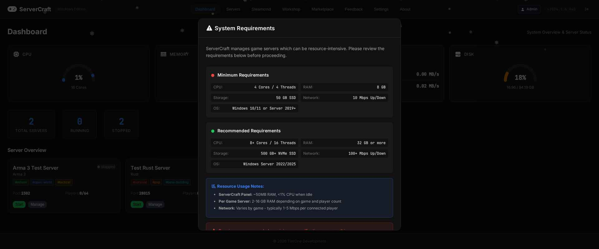
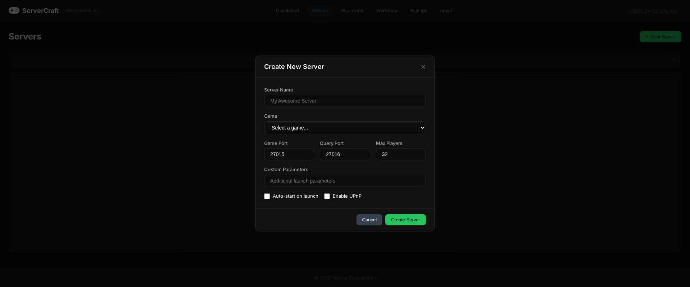
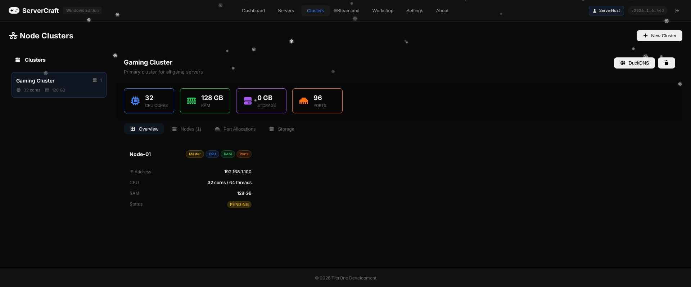
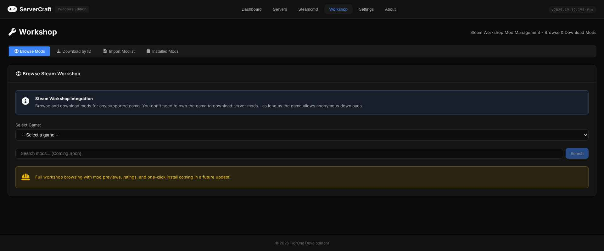
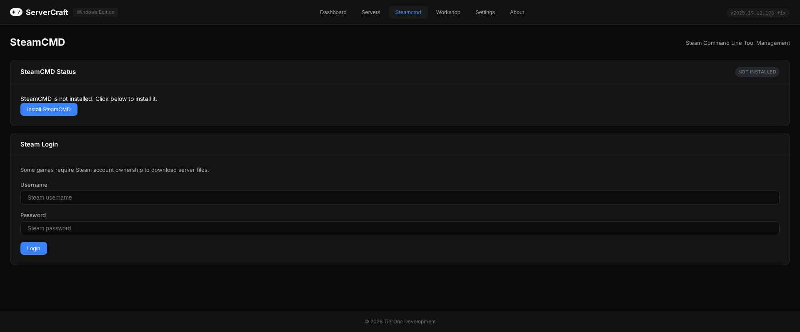
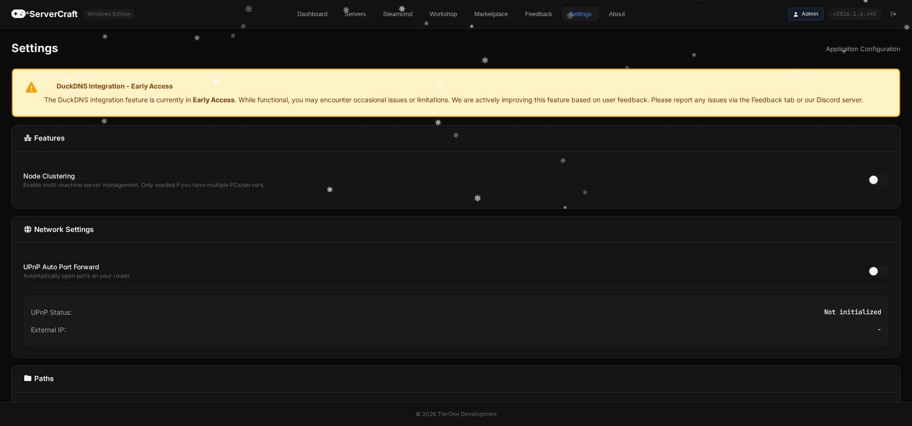
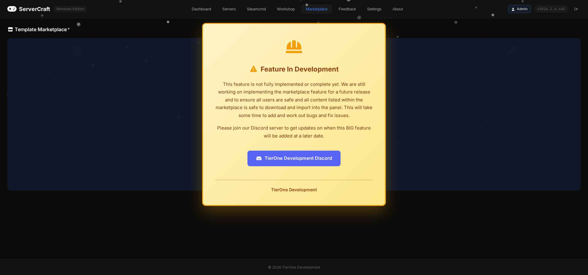
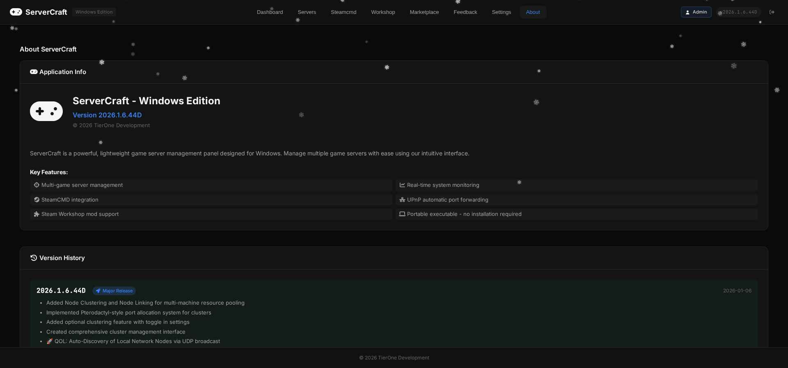

# 🎮 ServerCraft - Windows Edition

**A powerful, portable Windows game server management panel**

[Features](#features) • [Screenshots](#screenshots) • [Installation](#installation) • [Supported Games](#supported-games) • [Roadmap](#roadmap)

---

## 🚀 Features

### Core Features
- **🎯 One-Click Server Management** - Create, start, stop, and manage game servers with ease
- **📦 Portable Executable** - Single `.exe` file, no installation required
- **🔧 SteamCMD Integration** - Automatic game server downloads and updates
- **🎨 Modern Winter Theme** - Beautiful UI with animated snowflakes (Dec-Feb)

### Server Management
- **Multi-Game Support** - Support for 14+ popular game servers
- **Smart Port Allocation** - Automatic port assignment with 100-port ranges per game
- **Server Templates** - Save and reuse server configurations
- **Real-time Monitoring** - CPU, RAM, and network statistics

### Advanced Features
- **🌐 Node Clustering** - Connect multiple machines for distributed server hosting
- **📡 Auto-Discovery** - UDP broadcast to find other ServerCraft instances on your network
- **🔗 DuckDNS Integration** - Dynamic DNS for easy server access (Early Access)
- **🎮 Steam Workshop** - Browse and download mods directly from the panel

### Upcoming Features
- **🛒 Template Marketplace** - Share and download server configurations (Coming Soon)
- **📊 Analytics Dashboard** - Track server performance and usage
- **🔄 Auto-Updates** - Keep your servers up to date automatically

---

## 📸 Screenshots

### Dashboard

*Main dashboard showing server overview and system stats*

### Server Management

*Easy server creation with game-specific templates*

### Node Clustering

*Multi-machine cluster management interface*

### Steam Workshop

*Browse and manage Steam Workshop mods*

### SteamCMD Integration

*Integrated SteamCMD for game server downloads*

### Settings

*Comprehensive settings with DuckDNS integration*

### Marketplace (Coming Soon)

*Template marketplace preview - currently in development*

### About & Version History

*Version history and application information*

---

## 🎮 Supported Games

| Game | Steam App ID | Default Port Range |
|------|--------------|-------------------|
| Arma 3 | 233780 | 2302-2401 |
| Arma Reforger | 1874900 | 2001-2100 |
| DayZ (Vanilla) | 223350 | 2602-2701 |
| DayZ (Modded) | 223350 | 2702-2801 |
| Rust | 258550 | 28015-28114 |
| Project Zomboid | 380870 | 16261-16360 |
| Valheim | 896660 | 2456-2555 |
| Squad | 403240 | 7900-7999 |
| Ground Branch | 476400 | 7777-7876 |
| ICARUS | 1149480 | 17777-17876 |
| No One Survived | 1963370 | 8000-8099 |
| FiveM (GTA V RP) | - | 30120-30219 |
| Source Engine | 232250 | 27015-27114 |
| Minecraft | - | 25565-25664 |

---

## 💾 Installation

### Quick Start
1. Download the latest `ServerCraft.exe` from [Releases](../../releases)
2. Run the executable - no installation needed!
3. Create your first server using the intuitive wizard

### System Requirements
- **OS**: Windows 10/11 (64-bit)
- **RAM**: 4GB minimum (8GB+ recommended)
- **Storage**: Varies by game (10GB+ recommended)
- **Network**: Broadband internet connection

---

## 🗺️ Roadmap

### 🚀 Upcoming January Update (2026.1.6.C)
- 🔜 Node Clustering with resource pooling
- 🔜 Auto-Discovery via UDP broadcast
- 🔜 Smart port allocation per game
- 🔜 DuckDNS integration (Early Access)
- 🔜 Marketplace preview
- 🔜 Two-Factor Authentication (2FA)

### Future Updates (2026.2.x)
- 🔄 Template Marketplace launch
- 🔄 Enhanced analytics dashboard
- 🔄 Additional game support
- 🔄 Performance optimizations

### 📱 Future Ecosystem
- **Android App** - Remote server monitoring and management
  - 2FA-enabled authentication for secure access
  - Monitor game servers from anywhere with port forwarding or DuckDNS
  - Real-time server status, stats, and control
  - Push notifications for server events
- **Desktop Remote Connection App** - Connect to multiple ServerCraft instances
  - 2FA-enabled secure authentication
  - Manage servers across multiple machines from one interface
  - Perfect for distributed gaming communities

### 🎮 Game-Specific Features (Planned)
- **Assetto Corsa Custom Panel Integration**
  - Dedicated Assetto Corsa server management interface
  - Custom features specifically designed for AC server hosting
  - Integration with AC-specific hosting panel features
  - Track configuration and session management tools
  - *Note: Features will be exclusive to Assetto Corsa servers*

---

## 🤝 Community

**Join our Discord community for support, updates, and feature requests!**

---

## 📄 License

ServerCraft is proprietary software developed by TierOne Development. All rights reserved.

---

**Made with ❤️ by TierOne Development**

© 2026 TierOne Development

